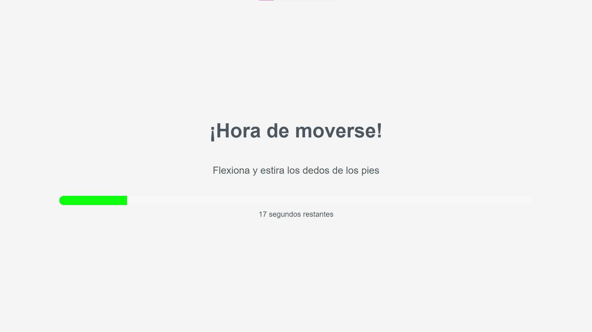
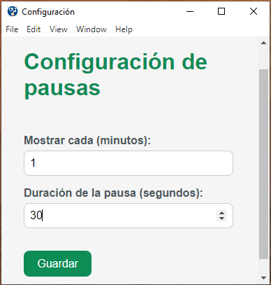

# 🧘‍♂️ Pausas Activas

Una aplicación de escritorio multiplataforma creada con **Electron + TypeScript** para fomentar el movimiento periódico durante la jornada laboral. Muestra actividades físicas breves cada cierto tiempo configurado por el usuario.

---

## 🚀 Características

* ⏱ Recordatorios automáticos configurables
* 💡 Ejercicios aleatorios cargados desde archivo
* 🛠 Ventana de configuración con tiempo de intervalo y duración
* 📦 Ejecutable `.exe` para Windows
* 🎨 Interfaz limpia, moderna y a pantalla completa
* 🖱 Icono en bandeja del sistema con opciones de control

---

## 🖼 Vista previa

### Pantalla de pausa:



### Configuración:



> 📁 Coloca tus capturas en la carpeta `screenshots/` (al lado del README)

---

## ⚙️ Requisitos

* Node.js >= 18
* npm
* Windows (para ejecutable), también funciona en Linux/Mac si se ejecuta con `electron .`

---

## 🛠 Instalación para desarrollo

```bash
npm install
npm run build
npm run start
```

Esto abrirá la app con recarga automática para desarrollo.

---

## 📦 Empaquetar versión ejecutable

```bash
npm run build
npm run package
```

Esto genera el instalador `.exe` en la carpeta `dist/`.

---

## 🧩 Estructura del proyecto

```
pausas-activas/
├── assets/                # Icono .ico para instalador
├── public/                # HTML, config.json y ejercicios
│   ├── config.json        # Configuración editable
│   ├── index.html         # Vista de pausa
│   ├── config.html        # Interfaz de configuración
├── src/
│   └── main.ts            # Lógica principal de Electron
├── screenshots/           # Capturas para el README
├── package.json
└── README.md
```

---

## 🧠 Autor

Laura Mercedes Gomez Ruidiaz
Ingeniera Electronica / Desarrollador Fullstack

---

¿Listo para moverte? 😉
